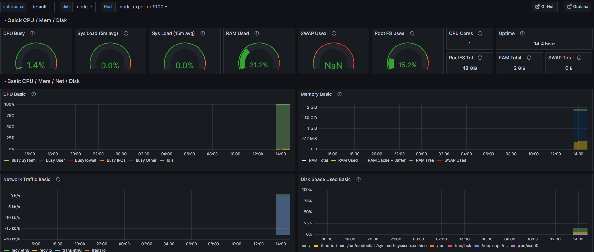

## Getting Started

* Create a new DO instance (whatever size, need to load test this)
* Setup ssh keys for the instance
* Clone https://github.com/nushackers/hnr-infra
* In a separate directory, clone https://github.com/nushackers/hnr-api
* Change the domain names and relative directory of api if needed.
* Run the `./deploy-up.sh` to start all the services, and `./deploy-down.sh` to stop everything

## Droplet Components

* Traefik + Let's Encrypt
    * This is the main proxy where all the traffic comes through and gets directed to different containers.
    * See `config` for additional configurations on this

* Prometheus
    * Where all the logs are aggregated. This is connected to an external Grafana instance for monitoring
    * See prometheus.yml for the different services we're monitoring

* hnr-api
    * This is where out API is deployed

## Observability Tools

* Traefik Metrics
* Node Exporter
* prometheus-net

## Grafana Dashboards

* We have a couple of Grafana dashboards to visualize the time series data we can get from Prometheus. Tentatively, we have three main dashboards

* Node Exporter - This gives us info on system details: RAM, CPU Usage, Networking

* Traefik - This gives us overall incoming and outgoing traffic information

* ASP.NET Core Dashboard - This gives us detailed per controller information on the API calls - This isn't very detailed, but is the best template I can find. Probably need to construct our own dashboard for this
    